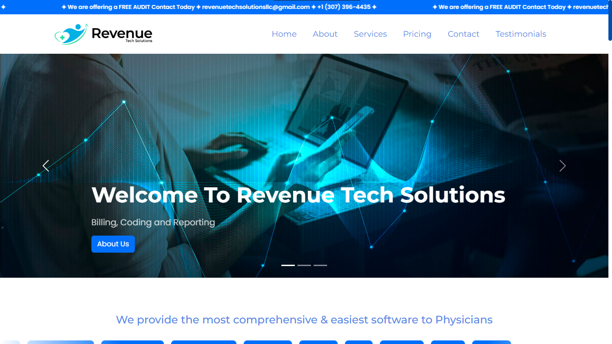

# 🌐 Revenue Tech Solutions LLC – Medical Billing & RCM Website

A clean, professional, and fully responsive website built for **Revenue Tech Solutions**, specializing in **medical billing**, **credentialing**, **denial management**, and **RCM services** for healthcare providers.

🔗 **Live Site**: https://www.revenuetechsolutions.com/

---

## 📸 Preview

---

## 🚀 Project Highlights

- ✅ **Industry-Focused Design**: Tailored layout for medical billing & RCM services
- ✅ **Responsive Across Devices**: Optimal experience on desktop, tablet, and mobile
- ✅ **Service-Oriented Sections**: Cleanly structured pages for About, Services, Pricing, Contact, and Testimonials
- ✅ **Trust-Building Elements**: Statistics, client quotes, and professional tone
- ✅ **Optimized Performance**: Fast loading, efficient vanilla HTML/CSS/JS
- ✅ **SEO & Accessibility**: Semantic structure for better discoverability

---

## 🏥 Business Context

Revenue Tech Solutions provides end-to-end RCM services to clinics, hospitals, and healthcare providers. Key offerings include:
- Medical Billing & Coding
- Denial Management
- Credentialing & Payer Enrollment
- Accounts Receivable (AR) Management
- Patient Scheduling & Reporting

## 📈 Value Delivered

This website serves as the publicly visible face of their business, helping:
- Communicate professionalism & trust
- Highlight services, pricing, and credibility
- Encourage lead generation via contact forms and CTA buttons
- Reinforce trust with testimonials and performance stats

---

## 🛠️ Tech Stack

- **HTML5**
- **CSS3 (Grid/Flexbox)**
- **Vanilla JavaScript**
- **Deployed** using custom domain hosting (cPanel)

---

## 💡 Using This Repo

⚠️ This is a client project. All rights to the design, content, and branding are owned by **Revenue Tech Solutions LLC**.  
This repository is shared strictly for **portfolio and demonstration purposes**. Please **do not reuse, redistribute, or replicate** without proper permission.

### Want a similar website?

You can adapt the structure and idea for your own business by:
1. Cloning the repository
2. Replacing branding, content, and visual assets
3. Updating links and contact details
4. Deploying to your preferred hosting platform

---

## ✨ Author

Crafted with attention to detail by **Danish Ali – Full Stack Developer & Graphic Designer**

GitHub: https://github.com/askdanish144

---

## 📬 Want a website like this?

I'm available to build responsive, business-focused websites tailored to any industry, whether you're a startup, local business, or growing brand.
➤ Email me at `askdanish144@gmail.com` to start a conversation.
